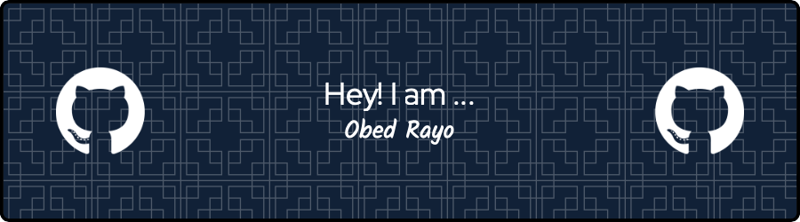

<h1 align="center"> WELCOME!! :raised_hand_with_fingers_splayed: </h1>

<h3 align="center">A passionate software developer with expertise in full-stack web development, specializing in backend technologies.</h3>

- 🔭 I’m currently working on **my web site**

- 🌱 I’m currently learning **CI/CD (Continuous Integration/Continuous Deployment), cloud technologies, scalability, and design patterns**

- 👯 I’m looking to collaborate on **innovative web development projects that involve cutting-edge technologies and frameworks**

- 🤝 I’m looking for help with **challenging backend development projects**

- 👨‍💻 All of my projects are available at [Reps](https://github.com/ObedRav?tab=repositories)

- 💬 Ask me about **Python, backend technologies, scalability, APIs, security, and authentication.**

- 📫 How to reach me **rayovianamiltonobed@gmail.com**

- 📄 Know about my experiences [resume](https://obedrav.dev/resume)

- ⚡ Fun fact **My first program wasn't a "Hello, World!"**

:globe_with_meridians: **Website**

- Visit my [website](https://obedrav.dev) to learn more about me and explore my portfolio.

🎯 **Open to Collaborations:**

- Interested in working on exciting projects and collaborating with talented developers.
  
- Feel free to reach out if you have any opportunities or interesting projects.

✨ **Passionate about Technology:**

- Constantly exploring new technologies and frameworks to expand my skill set.
  
- Enthusiastic about contributing to open-source projects and the developer community.

Let's connect and build something amazing together!

<picture>
  <source media="(prefers-color-scheme: dark)" srcset="https://raw.githubusercontent.com/ObedRav/ObedRav/output/github-contribution-grid-snake-dark.svg">
  <source media="(prefers-color-scheme: light)" srcset="https://raw.githubusercontent.com/ObedRav/ObedRav/output/github-contribution-grid-snake.svg">
  
</picture>

<h3 align="left">Connect with me:</h3>

<h3 align="left">Languages and Tools:</h3>

                              

